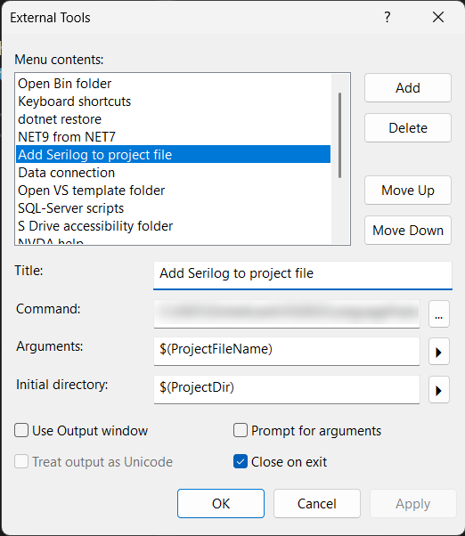

# About

This project is an external tool for Microsoft Visual Studio that adds SeriLog to an ASP.NET Core project if SeriLog is not a package in the currently selected project in Solution Explorer.

Note that the version of SeriLog was intentionally at a lower version than the current one, which is easy to update in the NuGet package manager.

## How to setup

1. Create a new external tool
1. `Command` set to this project executable
1. `Arguments` set to `$(ProjectFileName)`
1. `Initial directory` set to `$(ProjectDir)`

## Usage

Open Solution Explorer, select an ASP.NET Core project, and run the external tool. It will add SeriLog to the project if it is not already added. 

> [!IMPORTANT]
> Since Serilog configurations are specific to developer's needs, the tool does not add any configuration to the project. 