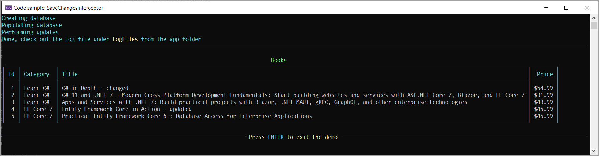

# Using an Interceptor to record changes for EF Core

In the project `ParameterizingValuesApp` we looked at checking out what was going on under the covers when reading and changing data to the console and to a file directly in code.

In this project an [Interceptor](https://learn.microsoft.com/en-us/ef/core/logging-events-diagnostics/interceptors) is used to inspect changes, write the changes, current and proposed values to a log file with the help of SeriLog.

There are several available interceptors, for this project we will use the [SaveChangesInterceptor](https://learn.microsoft.com/en-us/dotnet/api/microsoft.entityframeworkcore.diagnostics.isavechangesinterceptor?view=efcore-7.0).

Create a class, in this case AuditInterceptor which implements SaveChangesInterceptor followed by overriding SavingChangesAsync and SavingChanges. In both methods call a method shown below which iterates through the entities (EntityEntry) using a switch on each entity state (EntityState) and remember the current and proposed/new values to a log file using SeriLog.


```csharp
public class AuditInterceptor : SaveChangesInterceptor
{
    public override ValueTask<InterceptionResult<int>> SavingChangesAsync(
        DbContextEventData eventData, InterceptionResult<int> result, 
        CancellationToken cancellationToken = new CancellationToken())
    {
        Inspect(eventData);
        return base.SavingChangesAsync(eventData, result, cancellationToken);
    }


    public override InterceptionResult<int> SavingChanges(
        DbContextEventData eventData, 
        InterceptionResult<int> result)
    {
        Inspect(eventData);
        return base.SavingChanges(eventData, result);
    }

    public override int SavedChanges(SaveChangesCompletedEventData eventData, int result)
    {
        Debug.WriteLine($"changes:{eventData.EntitiesSavedCount}");
        return base.SavedChanges(eventData, result);
    }

    private static void Inspect(DbContextEventData eventData)
    {
        var changesList = new List<CompareModel>();

        foreach (EntityEntry entry in eventData.Context!.ChangeTracker.Entries())
        {
            switch (entry.State)
            {
                case EntityState.Added:
                    changesList.Add(new CompareModel()
                    {
                        OriginalValue = null,
                        NewValue = entry.CurrentValues.ToObject(),
                        EntityState = EntityState.Added.ToString()
                    });
                    break;
                case EntityState.Deleted:
                    changesList.Add(new CompareModel()
                    {
                        OriginalValue = entry.OriginalValues.ToObject(),
                        NewValue = null,
                        EntityState = EntityState.Deleted.ToString()
                    });
                    break;
                case EntityState.Modified:
                    changesList.Add(new CompareModel()
                    {
                        OriginalValue = entry.OriginalValues.ToObject(),
                        NewValue = entry.CurrentValues.ToObject(),
                        EntityState = EntityState.Modified.ToString()
                    });
                    break;
            }

            Log.Information($"\nchange list:{changesList.ToJson()}");

        }
    }


}
```


Results for several changed records

```json
[2023-01-21 13:05:54.172 [Information] 
change list:[
  {
    "OriginalValue": {
      "Id": 1,
      "Title": "C# in Depth",
      "Price": 44.99,
      "CategoryId": 1
    },
    "NewValue": {
      "Id": 1,
      "Title": "C# in Depth - changed",
      "Price": 54.99,
      "CategoryId": 1
    },
    "EntityState": "Modified"
  },
  {
    "OriginalValue": {
      "Id": 4,
      "Title": "Entity Framework Core in Action",
      "Price": 55.99,
      "CategoryId": 2
    },
    "NewValue": {
      "Id": 4,
      "Title": "Entity Framework Core in Action - updated",
      "Price": 45.99,
      "CategoryId": 2
    },
    "EntityState": "Modified"
  }
]
```

