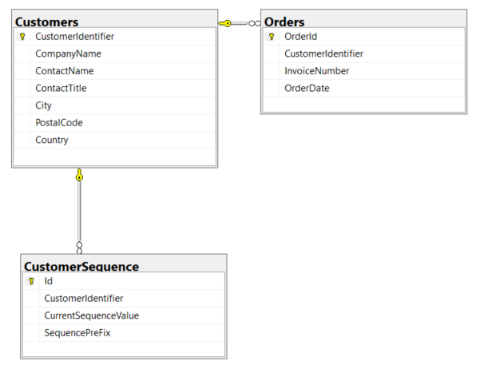
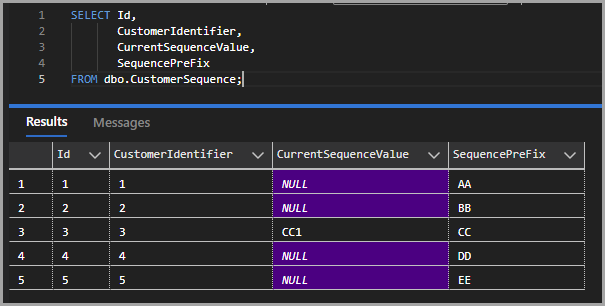
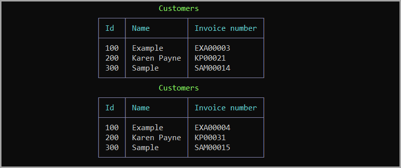

# Auto-Incrementing Sequences

Transaction numbers and invoice numbers that are alpha numeric are commonly used and in this code sample/article a method to produce alpha numeric is shown along with using a computed column.

## Base code

- Is in the class project AutoIncrementLibrary so its not tied to this demo project.

Keeping this simple, this is our model where data is stored in a json file, below there is a sample schema for a SQL-Server database. 


```csharp
public class Customer
{
    public int Id { get; set; }
    public string InvoiceValue { get; set; }
    public string Name { get; set; }
}
```

In a real application for a restaurant, this model may be used with data stored in a database.




Or perhaps, with the Customers table above with a sequence table. Below, only one record has been used, the others are ready for use.



With the above ideas, the core code shown below can be used with a json file or tables in a database.

- **NextValue**(string sender, int incrementBy = 1) accepts a value KP0000 and increments to KP0001 if `incrementBy` is not passed, otherwise if `incrementBy` is passed e.g. 10 for instance than KP0000 will become KP0010.

```csharp
public class Helpers
{

    /// <summary>
    /// Wrapper for NextValue as some may like this name
    /// </summary>
    public static string NextInvoiceNumber(string sender) 
        => NextValue(sender);


    /// <summary>
    /// Given a string which ends with a number, increment the number by  <seealso cref="incrementBy"/>
    /// </summary>
    /// <param name="sender"></param>
    /// <param name="incrementBy">increment by</param>
    /// <returns>string with ending number incremented by <seealso cref="incrementBy"/></returns>
    public static string NextValue(string sender, int incrementBy = 1)
    {
        string value = Regex.Match(sender, "[0-9]+$").Value;
        return sender[..^value.Length] + (long.Parse(value) + incrementBy)
            .ToString().PadLeft(value.Length, '0');
    }

    /// <summary>
    /// Wrapper for NextValue as some may like this name
    /// </summary>
    public static string NextInvoiceNumber(string sender, int incrementBy) 
        => NextValue(sender, incrementBy);

}
```

## Misuse

NexValue is not meant to be used in a environment where there is one sequence for, going back to the restaurant example or an ordering system as there could be a chance of duplication of invoice values.

Safe usage is using a prefix e.g. for an ordering system, if a customer name is Payne coffee the identifer might be PAC and the intial sequence PAC00000 which means using NextValue for the first order would be PAC00001.

## Other considerations

Perhaps include a column in the database table for year and reset the sequence each year for an ordering system so an application can query by sales for customers by year.

## Simple example 

The following reads from a json file, updates sequences and save back to the file.

```json
[
  {
    "Id": 100,
    "InvoiceValue": "EXA00004",
    "Name": "Example"
  },
  {
    "Id": 200,
    "InvoiceValue": "KP00031",
    "Name": "Karen Payne"
  },
  {
    "Id": 300,
    "InvoiceValue": "SAM00015",
    "Name": "Sample"
  }
]
```



