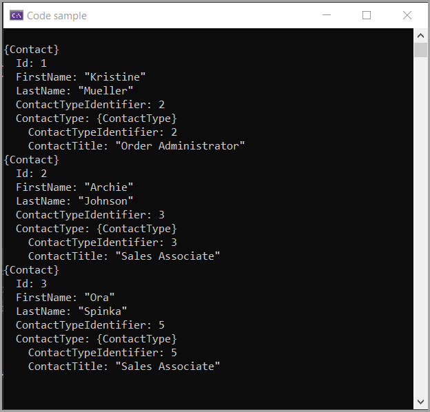

# Bogus custom DataSets

Sometimes when mocked data is needed using Bogus data should refect data say from a known database.

This project shows how to creae a custom Bogus DataSet for NorthWind database Contact and ContactType.

Also some experimenting with NorthWind Categories.

Also has sample code to serialize a Contact to a file using [protobuf-net](https://github.com/protobuf-net/protobuf-net).