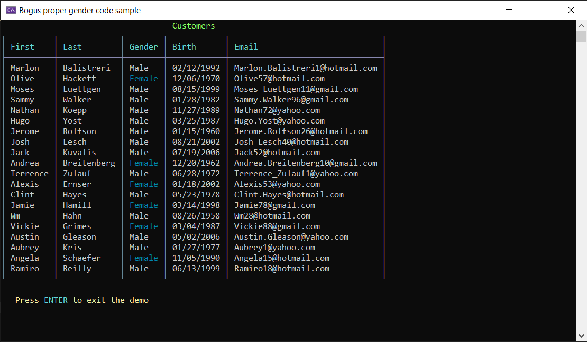

# About

An example for having Bogus match first name to the proper gender by passing in the gender to the FirstName constructor while not passing gender to FirstName a female may have a male name and a male may have a female name.

