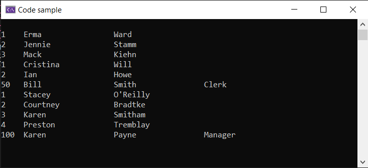

# About

Got tired of seeing cookie cutter code samples so this one is not cookie cutter.

```csharp
internal partial class Program
{
    static void Main(string[] args)
    {
        List<Human> people1 = BogusOperations.People(3);
        List<Human> people2 = BogusOperations.People(2);
        List<Human> people3 = BogusOperations.People(4);
        Employee manager = new() { Id = 100, FirstName = "Karen", LastName = "Payne", Title = "Manager" };
        Employee salesPerson = new() { Id = 100, FirstName = "Bill", LastName = "Smith", Title = "Clerk" };

        List<Human> people = [ ..people1, ..people2, salesPerson, ..people3, manager];

        foreach (var human in people)
        {
            if (human is Employee employee)
            {
                Console.WriteLine($"{employee.Id,-5}{employee.FirstName,-20}{employee.LastName,-20}{employee.Title}");
            }
            else
            {
                Console.WriteLine($"{human.Id,-5}{human.FirstName,-20}{human.LastName}");
            }
            
        }

        ExitPrompt();

    }
}
```


