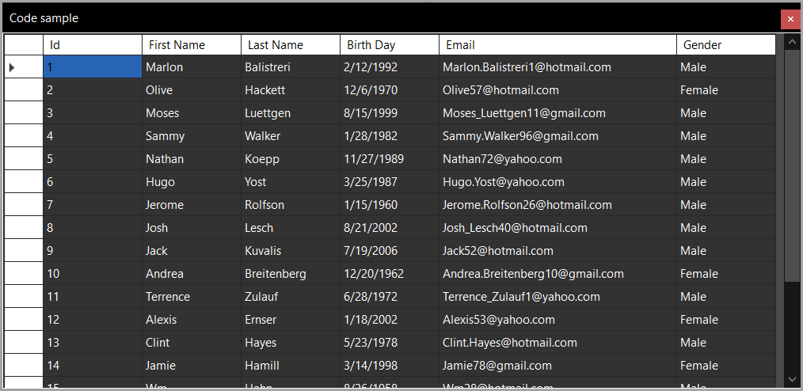

Example of dark mode. Code resides in the class project WinFormsSystemColorModeLibrary.

Check out code in the project KP_WindowsFormsNET9 for an example using TextBox and Labels along with setting color mode in a form.

The following is a standard DataGridView which needs addition modifications if the headers are not appealing.

## Microsoft docs

> **Note**
> This feature set is experimental.

See the [following](https://learn.microsoft.com/en-us/dotnet/desktop/winforms/whats-new/net90?view=netdesktop-9.0#dark-mode).

## Article

https://dev.to/karenpayneoregon/window-forms-dark-mode-33on