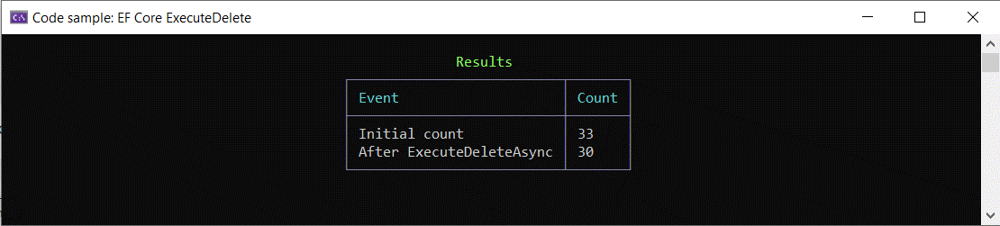
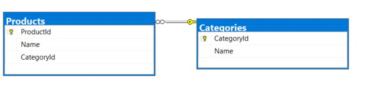

# About

Example for ExecuteDeleteAsync

Data is populated in `ProductContext`, each time the application run the database is recreated via

```csharp
await context.Database.EnsureDeletedAsync();
await context.Database.EnsureCreatedAsync();
```

Next obtain a count of records for validation purposes only

```csharp
var list = await context
    .Products
    .AsNoTracking()
    .ToListAsync();

table.AddRow("Initial count", list.Count.ToString());
```

Perform the delete operation where category equals 3

```csharp
await context.Products.Where(p => p.CategoryId == 3).ExecuteDeleteAsync();
```

Get count after deletion above

```csharp
table.AddRow("After ExecuteDeleteAsync", context.Products.AsNoTracking().Count().ToString());
```




Note the schema is different from ExecuteUpdateSample project, there is no Price column.

