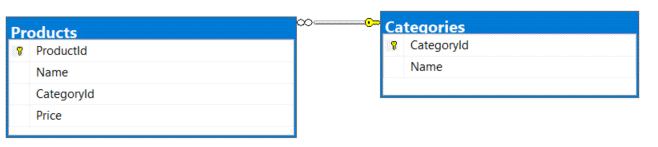

# About

Example for ExecuteUpdateAsync

Data is populated in `ProductContext`, each time the application run the database is recreated via

```csharp
await context.Database.EnsureDeletedAsync();
await context.Database.EnsureCreatedAsync();
```

```csharp
internal partial class Program
{
    static async Task Main(string[] args)
    {
        await using var context = new ProductsContext();

        await context.Database.EnsureDeletedAsync();
        await context.Database.EnsureCreatedAsync();

        await context.Products
            .Where(p => p.Price > 10)
            .ExecuteUpdateAsync(s => s
                .SetProperty(p => p.Name, p => p.Name + " *")
                .SetProperty(p => p.Price, p => p.Price - 12));
    }
}
```

Here, any product with a price over 10 add an asterisk to the product name, subtract 12 from the price.

Note the schema is different from ExecuteDeleteSample project, the Price column was added.

