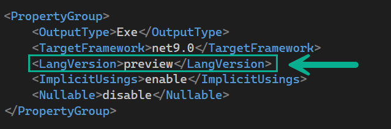

# About

The `field` keyword would allow us to create semi-automatic properties. 

- See Micorosoft's [documentation](https://learn.microsoft.com/en-us/dotnet/csharp/language-reference/keywords/field) for more information.
- Blog post: [The C# "field" Keyword and Visual Studio Tooling](https://jeremybytes.blogspot.com/2024/11/the-c-field-keyword-and-visual-studio.html)


## Requires

The following as `field` is still in preview.




## Example 1

Uppercase firt letter. 

```csharp
public required string FirstName
{
    get;
    set => field = value.CapitalizeFirstLetter();
}
```

## Example 2

Uppercase property value followed by a validation.

```csharp
public required string State
{
    get;
    set
    {
        field = value.ToUpper();
        if (!GetStateAbbreviations().Contains(field))
        {
            throw new ArgumentException("Invalid state abbreviation.");
        }
    }
}
```

## Documentation

By JetBrains [AI assistant](https://www.jetbrains.com/ai/ai-assistant-features/)