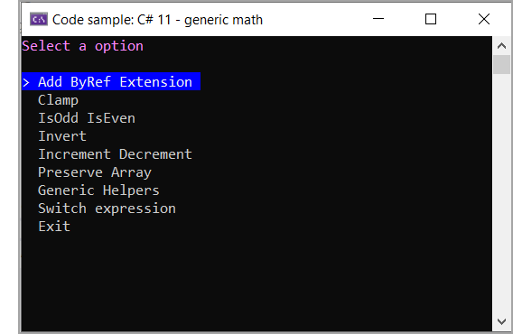

# Generic Math 

*Generic Math combines the power of generics and a new feature known as static virtuals in interfaces to allow .NET developers to take advantage of static APIs, including operators, from generic code. This means that you get all the power of generics, but now with the ability to constrain the input to number like types, so you no longer need to write or maintain many near identical implementations just to support multiple types. It also means that you get access to all your favorite operators and can use them from generic contexts.*

~From Microsoft

There are many advantages for all developer beginning with consistent code and when implemented as language extensions make maintaining these extensions easer.

Example to sum the elements in an array using conventional method

```csharp
int[] arr = new int[] { 22, 22 };
int sum = arr.Sum();
```

Or

```csharp
int sum = 0;
Array.ForEach(arr, delegate (int i) { sum += i; });
```

Both provide the same sum, but suppose there is a need to have conditions, we can write the following using [INumber interface](https://learn.microsoft.com/en-us/dotnet/api/system.numerics.inumber-1?view=net-7.0) and using a [Span](https://learn.microsoft.com/en-us/dotnet/api/system.span-1?view=net-7.0) speeds up the operations.

```csharp
public class GenericHelpers
{
    public static T AddAll<T>(Span<T> values) where T : INumber<T> => values switch
    {
        [] => T.Zero,
        [var first, .. var rest] => first + AddAll<T>(rest)
    };
}
```

In the conventional examples above we added 22 + 22, we will do the same with `AddAll`

```csharp
int[] arr = new int[] { 22, 22 };
var result = arr.AddAll();
```

The above works no different for other numeric types such as `double`.

```csharp
double[] arr = { 22, 22 };
var result = arr.AddAll();
```

No matter the type the code is the same although we can explicitly indicate the type without changing functionality.

```csharp
double[] arr = { 22, 22 };
var result = arr.AddAll<double>();
```

For those who are not fans of extension methods we can write 

```csharp
public static T AddAll<T>(T[] sender) where T : INumber<T>
{
    T result = T.Zero;
    foreach (T item in sender) { result += item; }
    return result;
}
```

Usage

```csharp
var result = GenericHelpers.AddAll<double>(new double[] {22.5,22.6 });
```

Or

```csharp
var result = GenericHelpers.AddAll(new double[] {22.5,22.6 });
```

# Complex usages

A common operation is to read a delimited text file, with that suppose the text file has several numeric columns of one type and there is a possibility of values not being the correct type. The methods below take care of this although we must have one for each type.

```csharp
public static int[] ToIntegerArray(this string[] sender)
{

    var intArray = Array
        .ConvertAll(sender,
            (input) => new
            {
                IsInteger = int.TryParse(input, out var integerValue),
                Value = integerValue
            })
        .Where(result => result.IsInteger)
        .Select(result => result.Value)
        .ToArray();

    return intArray;
}
public static double[] ToDoubleArray(this string[] sender)
{

    var doubleArray = Array
        .ConvertAll(sender,
            (input) => new
            {
                IsDouble = double.TryParse(input, out var doubleValue),
                Value = doubleValue
            })
        .Where(result => result.IsDouble)
        .Select(result => result.Value)
        .ToArray();

    return doubleArray;
}
public static decimal[] ToDecimalArray(this string[] sender)
{

    var decimalArray = Array
        .ConvertAll(sender,
            (input) => new
            {
                IsDecimal = decimal.TryParse(input, out var decimalValue),
                Value = decimalValue
            })
        .Where(result => result.IsDecimal)
        .Select(result => result.Value)
        .ToArray();

    return decimalArray;
}
```

Using generic math the above can be done with one method.

```csharp
public static T[] ToNumberArray<T>(this string[] sender) where T : INumber<T> =>
    Array
        .ConvertAll(sender,
            (input) => new
            {
                IsNumber = T.TryParse(input, NumberStyles.Any, CultureInfo.CurrentCulture, out var value),
                Value = value})
        .Where(result => result.IsNumber)
        .Select(result => result.Value)
        .ToArray();
```

Another method, a pre-check, here is one for `int` while we need one for `decimal` and `double` to match the ones above.

```csharp
public static int[] GetNonIntegerIndexes(this string[] sender)
{
    return sender.Select(
        (item, index) => int.TryParse(item, out var tResult) ?
            new { IsInteger = true, Index = index } :
            new { IsInteger = false, Index = index })
        .ToArray()
        .Where(item => item.IsInteger == false)
        .Select(item => item.Index).ToArray();
}
```


While the following works with `int`, `decimal` and `double` along with `short` and `float` . . .

```csharp
public static int[] GetNonNumericIndexes<T>(this string[] sender) where T : INumber<T> =>
    sender.Select(
            (item, index) => T.TryParse(item, NumberStyles.Any | NumberStyles.AllowDecimalPoint, 
                CultureInfo.CurrentCulture, out var _) ?
                new { IsNumber = true, Index = index } :
                new { IsNumber = false, Index = index })
        .ToArray()
        .Where(item => item.IsNumber == false)
        .Select(item => item.Index).ToArray();
```

Another pre-check, are all elements of the specific type? Here its best to use convetional methods.

```csharp
public static bool AllDouble(this string[] sender)
    => sender.All(item => double.TryParse(item, out _));
public static bool AllDecimal(this string[] sender)
    => sender.All(item => decimal.TryParse(item, out _));
public static bool AllInt(this string[] sender)
    => sender.SelectMany(item => item.ToCharArray()).All(char.IsNumber);
```

# Code samples

See the console project `GenericMathConsoleApp` for several working examples of what has been presented and more.



# See also

- [What's new in .NET 7](https://learn.microsoft.com/en-us/dotnet/core/whats-new/dotnet-7)
- [What's new in C# 11](https://learn.microsoft.com/en-us/dotnet/csharp/whats-new/csharp-11)
- [What's new in ASP.NET Core 7.0](https://learn.microsoft.com/en-us/aspnet/core/release-notes/aspnetcore-7.0?view=aspnetcore-7.0)
- [Breaking changes in .NET 7](https://learn.microsoft.com/en-us/dotnet/core/compatibility/7.0?toc=%2Fdotnet%2Ffundamentals%2Ftoc.json&bc=%2Fdotnet%2Fbreadcrumb%2Ftoc.json)

# Summary

Various simple and complex examples have been presented to compliment the basic examples found at Microsoft and on the web. Next step is to explore what Microsoft has done e.g. use in `System.Linq.Enumerable` (this is really easy to get at using [Resharper](https://www.jetbrains.com/resharper/) Visual Studio extension).

Also, check out language extensions in `GenericMathLibrary.IComparableExtensions` which are based off IComparable&lt;T>

```csharp
private static TResult? Sum<TSource, TResult, TAccumulator>(this IEnumerable<TSource> source, Func<TSource, TResult?> selector)
    where TResult : struct, INumber<TResult>
    where TAccumulator : struct, INumber<TAccumulator>
{
    if (source is null)
    {
        ThrowHelper.ThrowArgumentNullException(ExceptionArgument.source);
    }

    if (selector is null)
    {
        ThrowHelper.ThrowArgumentNullException(ExceptionArgument.selector);
    }

    TAccumulator sum = TAccumulator.Zero;
    foreach (TSource item in source)
    {
        if (selector(item) is TResult selectedValue)
        {
            checked { sum += TAccumulator.CreateChecked(selectedValue); }
        }
    }

    return TResult.CreateTruncating(sum);
}
```


