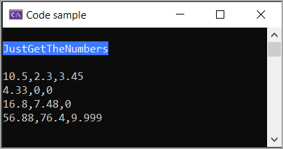
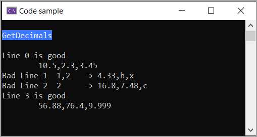
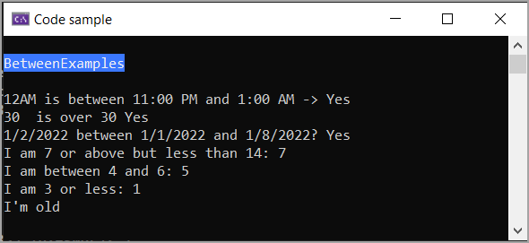

In this article [generic math](https://learn.microsoft.com/en-us/dotnet/standard/generics/math) is used along with [pattern matching](https://learn.microsoft.com/en-us/dotnet/csharp/language-reference/operators/patterns) to parse a string, assert there are five elements per and if so get the last three elements, determine if they are numeric.

Rather than read from a file, data comes from mocked up data using [raw string literal](https://learn.microsoft.com/en-us/dotnet/csharp/language-reference/proposals/csharp-11.0/raw-string-literal).


Sample data

```csharp
internal class MockedData
{
    public static string FileDataForIntegers()
    {
        var lines = 
            """
            Karen,Payne,1,2,3
            May,Jones,4,b,x
            Jack,Smith,6,7,c
            ,,56,76,9
            """;

        return lines;
    }

    public static string FileDataForDecimals()
    {
        var lines =
            """
            Karen,Payne,10.5,2.3,3.45
            May,Jones,4.33,b,x
            Jack,Smith,16.8,7.48,c
            ,,56.88,76.4,9.999
            """;

        return lines;
    }
}
```

## Example  1

Using **MockedData.FileDataForDecimals()** get all decimals. The method below is generic which means it can be used for int, decimal etc.

If an element can not represent a numeric, 0 is used as the value.


```csharp
public static T[] ToNumbersPreserveArray<T>(this string[] sender) where T : INumber<T>
{

    var array = Array.ConvertAll(sender, (input) =>
    {
        T.TryParse(input, NumberStyles.Any | 
                          NumberStyles.AllowDecimalPoint | 
                          NumberStyles.Float, CultureInfo.CurrentCulture, out var integerValue);
        return integerValue;
    });

    return array;

}
```

Code which

- Creates an anonymousItem type for each line, the line index and string array
- Iterates each element in **lines**
- Using pattern, skip first two elements, create a string array names **values**
- Use the generic method ToNumbersPreserveArray to transform **values** array to decimal array

> **Note**
> Here anonymousItem is a tad overkill but will see it used in a upcoming code sample. Also, I'm sure a reader will think there is a better way and all bases are not covered, feel free to add that, here the topic is on generic math. Explore ListPatternApp for more on assertions.

```csharp
public static void JustGetTheNumbers()
{
    Print();

    var lines = MockedData.FileDataForDecimals()
        .Split(Environment.NewLine)
        .Select((line, index) => new
        {
            Index = index, 
            Items = line.Split(',')
        })
        .ToArray();

    foreach (var anonymousItem in lines)
    {
        if (anonymousItem.Items is [_, _, .. var values])
        {
            var results = anonymousItem.Items.ToNumbersPreserveArray<decimal>();
            Console.WriteLine(string.Join(",", results.Skip(2)));
        }
    }
}
```

Results, note the elements that do not represent a number are 0.



## Example  2

Same loading of data as the first example, difference is if a line values that were expected to by a decimal are flagged using GetNonNumericIndexes extension method.


```csharp
public static void GetDecimals()
{
    Print();

    var lines = MockedData.FileDataForDecimals()
        .Split(Environment.NewLine)
        .Select((line, index) => new { Index = index, Items = line.Split(',') })
        .ToArray();

    foreach (var anonymousItem in lines)
    {
        if (anonymousItem.Items is [_, _, .. var values])
        {
            var results = values.GetNonNumericIndexes<decimal>();
            if (results.Length > 0)
            {
                Console.WriteLine(
                    $"Bad Line {anonymousItem.Index,-3}{string.Join(",", results),-5} -> {string.Join(",", anonymousItem.Items.Skip(2))}");
            }
            else
            {
                Console.WriteLine($"Line {anonymousItem.Index} is good");
                decimal[] numbers = anonymousItem.Items.ToNumberArray<decimal>();
                Console.WriteLine($"\t{string.Join(",", numbers)}");
            }
        }
    }
}
```

Extension method to obtain, in this case elements which could not represent a decimal.

```csharp
public static int[] GetNonNumericIndexes<T>(this string[] sender) where T : INumber<T> =>
    sender.Select(
            (item, index) => T.TryParse(item, NumberStyles.Any | NumberStyles.AllowDecimalPoint, CultureInfo.CurrentCulture, out var _) ?
                new { IsNumber = true, Index = index } :
                new { IsNumber = false, Index = index })
        .ToArray()
        .Where(item => item.IsNumber == false)
        .Select(item => item.Index).ToArray();
```

Results



Since we are discussing generic math, the following uses the exact same extension, this time for int.

```csharp
public static void GetIntegers()
{
    Print();

    var lines = MockedData.FileDataForIntegers()
        .Split(Environment.NewLine)
        .Select((line, index) => new { Index = index, Items = line.Split(',') })
        .ToArray();

    foreach (var anonymousItem in lines)
    {
        if (anonymousItem.Items is [_, _, .. var values])
        {
            var results = values.GetNonNumericIndexes<int>();
            if (results.Length > 0)
            {
                Console.WriteLine(
                    $"Bad Line {anonymousItem.Index,-3}{string.Join(",", results),-5} -> {string.Join(",", anonymousItem.Items.Skip(2))}");
            }
            else
            {
                Console.WriteLine($"Line {anonymousItem.Index} is good");
                int[] numbers = anonymousItem.Items.ToNumberArray<int>();
                Console.WriteLine($"\t{string.Join(",", numbers)}");
            }
        }
    }
}
```

## Without generic math

We need an extension for each type to maintain.


```csharp
public static decimal[] ToDecimalPreserveArray(this string[] sender)
{

    var decimalArray = Array.ConvertAll(sender, (input) =>
    {
        decimal.TryParse(input, out var decimalValue);
        return decimalValue;
    });

    return decimalArray;

}


public static int[] ToIntPreserveArray(this string[] sender)
{

    var intArray = Array.ConvertAll(sender, (input) =>
    {
        int.TryParse(input, out var intValue);
        return intValue;
    });

    return intArray;

}
```

## Considerations

There are [advantages and disadvantages of generics](https://learn.microsoft.com/en-us/dotnet/standard/generics/#advantages-and-disadvantages-of-generics) including generic math and part of this can come from being stuck in old habits, unwilling to change are a few.

Consider on a similar note, generics can lessen code such having a generic between method.


```csharp
public static class IComparableExtensions
{
    public static bool Between<T>(this T value, T lowerValue, T upperValue)
        where T : struct, IComparable<T>
        => Comparer<T>.Default.Compare(value, lowerValue) >= 0 &&
           Comparer<T>.Default.Compare(value, upperValue) <= 0;

    public static bool BetweenExclusive<T>(this IComparable<T> sender, T minimumValue, T maximumValue)
        => sender.CompareTo(minimumValue) > 0 && sender.CompareTo(maximumValue) < 0;

    public static bool IsGreaterThan<T>(this T sender, T value) where T : IComparable
        => sender.CompareTo(value) > 0;

    public static bool IsLessThan<T>(this T sender, T value) where T : IComparable
        => sender.CompareTo(value) < 0;
}
```

Examples

The TimeOnly is from the .NET Framework while the others are from the extensions shown below where any object that implement [IComparable](https://learn.microsoft.com/en-us/dotnet/api/system.icomparable?view=net-7.0) can be used.

```csharp
public static class IComparableExtensions
{
    public static bool Between<T>(this T value, T lowerValue, T upperValue)
        where T : struct, IComparable<T>
        => Comparer<T>.Default.Compare(value, lowerValue) >= 0 &&
           Comparer<T>.Default.Compare(value, upperValue) <= 0;

    public static bool BetweenExclusive<T>(this IComparable<T> sender, T minimumValue, T maximumValue)
        => sender.CompareTo(minimumValue) > 0 && sender.CompareTo(maximumValue) < 0;

    public static bool IsGreaterThan<T>(this T sender, T value) where T : IComparable
        => sender.CompareTo(value) > 0;

    public static bool IsLessThan<T>(this T sender, T value) where T : IComparable
        => sender.CompareTo(value) < 0;

    public static string CaseWhen(this int sender)
    {
        return sender switch
        {
            { } value1 and >= 7 and <= 14 => $"I am 7 or above but less than 14: {value1}",
            { } value2 when value2.Between(4, 6) => $"I am between 4 and 6: {value2}",
            { } value3 when (value3.IsLessThan(3)) => $"I am 3 or less: {value3}",
            _ => "I'm old"
        };
    }
}
```

Let's try out these extension methods.

```csharp
public static void BetweenExamples()
{

    Print();

    TimeOnly startTime = TimeOnly.Parse("11:00 PM");
    var hoursWorked = 2;
    TimeOnly endTime = startTime.AddHours(hoursWorked);

    // IsBetween here is native to TimeOnly
    var isBetween = TimeOnly.Parse("12:00 AM").IsBetween(startTime, endTime);
    Console.WriteLine($"12AM is between {startTime} and {endTime} -> {isBetween.ToYesNo()}");

    // uses our extension
    var age = 30;
    Console.WriteLine($"{age,-3} is over 30 {age.Between(30, 33).ToYesNo()}");

    DateTime lowDateTime = new(2022, 1, 1);
    DateTime someDateTime = new(2022, 1, 2);
    DateTime highDateTime = new(2022, 1, 8);

    // uses our extension switch expression
    Console.WriteLine($"{someDateTime:d} between {lowDateTime:d} and {highDateTime:d}? {someDateTime.Between(lowDateTime, highDateTime).ToYesNo()}");

    // uses our extension within a 
    Console.WriteLine($"{7.CaseWhen()}");
    Console.WriteLine($"{5.CaseWhen()}");
    Console.WriteLine($"{1.CaseWhen()}");
    Console.WriteLine($"{16.CaseWhen()}");
}
```

Results



## Summary

In this article I've touched on one benefit for using generics, there are others that can be found in the project [GenericMathLibrary](https://github.com/karenpayneoregon/csharp-11-ef-core-7-features/tree/master/GenericMathLibrary) and [GenericMathConsole](https://github.com/karenpayneoregon/csharp-11-ef-core-7-features/tree/master/GenericMathConsoleApp) projects while code presented here is in the project GenericMathListPatternConsoleApp.

## Source code

Clone the following [repository](https://github.com/karenpayneoregon/csharp-11-ef-core-7-features) which was setup for when .NET Core 7 was released so there is more code than simply generic math.


