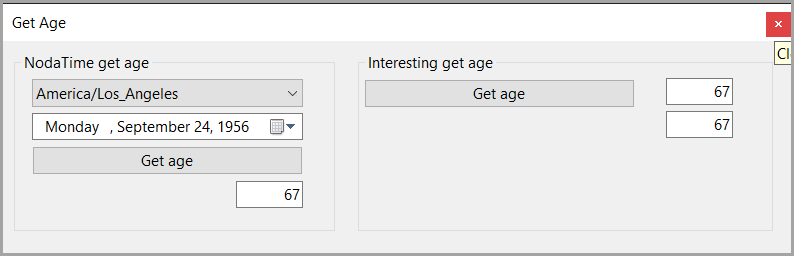

# About

Found a [thread](https://stackoverflow.com/questions/9/how-do-i-calculate-someones-age-based-on-a-datetime-type-birthday?page=1&tab=modifieddesc#tab-top) on Stackoverflow asking

*How do I calculate someone's age based on a DateTime type birthday?*

## Windows Forms

There are two options for exploring, first in using a console project which in this case needs more code than I wanted e.g. create a menu with [Spectre.Console](https://spectreconsole.net/) along with Spectre.Console inputs. Although this is a great way to go Windows Forms is easier. When coded properly either or project types code can be ported to other project types.



Interesting to see there are 75 answers :dizzy_face:

The following was selected as the answer.

```csharp
// Save today's date.
var today = DateTime.Today;

// Calculate the age.
var age = today.Year - birthdate.Year;

// Go back to the year in which the person was born in case of a leap year
if (birthdate.Date > today.AddYears(-age)) age--;
```

But I explored and found a solution using

- An interesting reply
- NodaTime

So this project explores the two above.

## Interesting solution

```csharp
(2023_12_23 - 1956_09_24) / 10000
```

## NodaTime

Which needed minor code change as the version of NodaTime used and the current version had breaking changes.

```csharp
public class NodaTimeOperations
{
    public static int GetAge(LocalDate dateOfBirth, string selectedZone)
    {

        Instant now = SystemClock.Instance.GetCurrentInstant();

        // The target time zone is important.
        // It should align with the *current physical location* of the person
        DateTimeZone zone = DateTimeZoneProviders.Tzdb[selectedZone];

        LocalDate today = now.InZone(zone).Date;

        Period period = Period.Between(dateOfBirth, today, PeriodUnits.Years);

        return (int)period.Years;
    }
}
```

