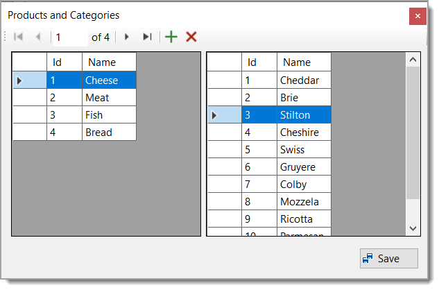

# EF Core: First-class Windows Forms data binding

Microsoft

The Windows Forms team have been making some [great improvements to the Visual Studio Designer experience](https://devblogs.microsoft.com/dotnet/state-of-the-windows-forms-designer-for-net-applications/). This includes new [experiences](https://devblogs.microsoft.com/dotnet/databinding-with-the-oop-windows-forms-designer/) for data binding that integrates well with EF Core.

# Source code

:trident: Base source code came from Microsoft, Karen Payne did several touch-ups and additions. The reason for taking this code from Microsoft is because the only true way to obtain the code is to download [this repository](https://github.com/dotnet/EntityFramework.Docs) and I save you the trouble.

# BindingNavigator

From .NET Core 5 onwards there is no BindingNavigator in the toolbox so Karen added the following which exposes a BindingNavigator to the Visual Studio toolbox. To have it for any project, create a class project, add CoreBindingNavigator to the project, build than [add the BindingNavigator to the Visual Studio ToolBox](https://learn.microsoft.com/en-us/visualstudio/ide/reference/toolbox?view=vs-2019).

```csharp
public class CoreBindingNavigator : BindingNavigator
{
    public CoreBindingNavigator()
    {
        AddStandardItems();
    }
}
```

Check out `DataGridViewExtensions.cs` for other goodies for a DataGridView.


<br>

