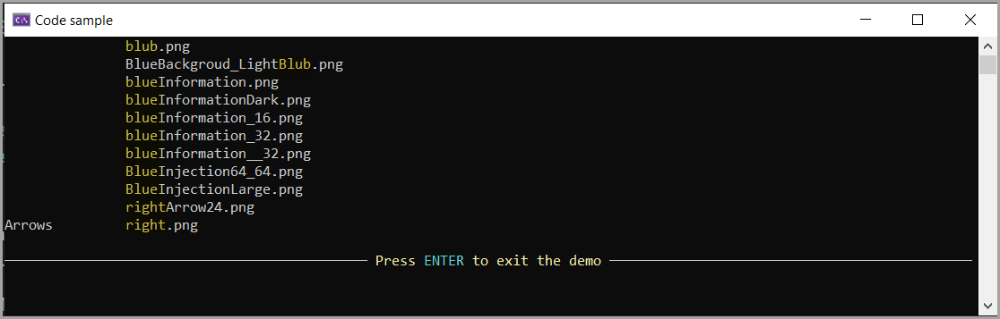

# About

Example for [Globbing](https://learn.microsoft.com/en-us/dotnet/core/extensions/file-globbing) Images under a specific folder.

In this example we want `.png` files with the following criteria:

- Include file names starting with `Ri` and `Bl`
- Exclude files names starting with `Blog` and `Black` plus file names containg `*arrow_16*`

Currently, the folder is `My Documents\Snagit` where Snagit is a screen capture utility.

In the screenshot below, the empty space indicates the root folder while, in this case Arrows is a subfolder.

