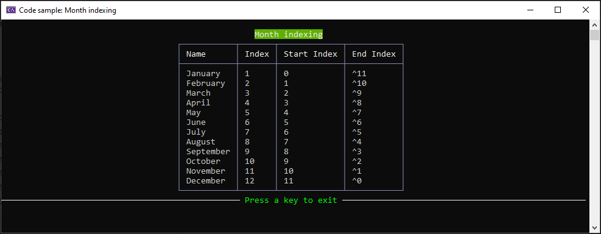

# About

A simple code sample to get acquainted with indexing using months of the year. In the screenshot below, month names are shown followed by the month index then we get into indices, start and end.

# Resources

- Microsoft docs [Ranges](https://learn.microsoft.com/en-us/dotnet/csharp/language-reference/proposals/csharp-8.0/ranges)
- JetBrains [Indices, Ranges, and Null-coalescing Assignments](https://blog.jetbrains.com/dotnet/2019/04/24/indices-ranges-null-coalescing-assignments-look-new-language-features-c-8/)