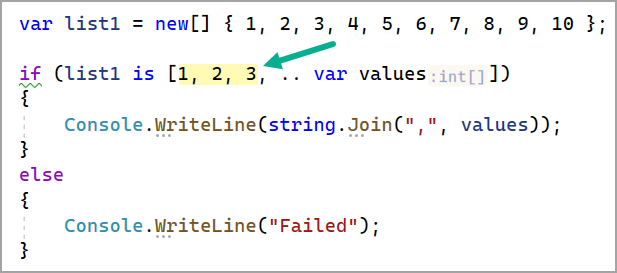
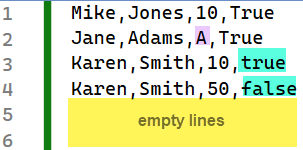
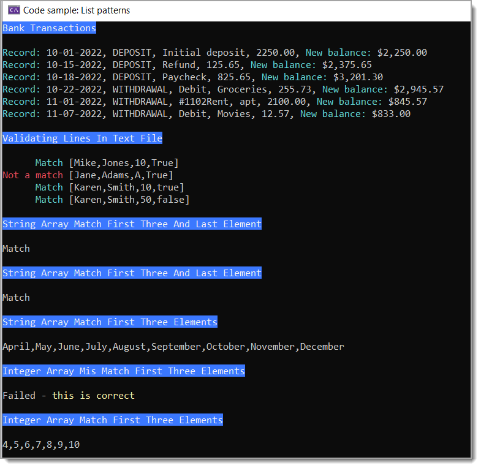

# List patterns

Beginning with C# 11, you can match an array or a list against a sequence of patterns

Microsoft [docs](https://learn.microsoft.com/en-us/dotnet/csharp/language-reference/operators/patterns#list-patterns)

- The discard pattern (`_`) matches any single element
- the new range pattern (`..`) matches any sequence of zero or more elements.

# Important

:beginner: When working with `list patterns` the pattern must be a constant which means a `DateTime` or `DateOnly` can not be used as per C# specifications these types can not be constants.




# Usage

A `list pattern` might be used for validating data read from a text file or some other source.

Simple example, each line in a file must have

First name, Last name, identifier and ending element a bool. Given the following

1. Ignore empty lines
1. Validate first two elements exists using [discards](https://learn.microsoft.com/en-us/dotnet/csharp/fundamentals/functional/discards) followed be a value of 10 or 50
1. Validate last element can represent a bool.

```csharp
string[] lines = File.ReadAllLines("Sample1.txt")
    .Where(x => !string.IsNullOrWhiteSpace(x))
    .ToArray();

foreach (var line in lines)
{
    var parts = line.Split(',');
    if (parts is [ _, _, "10" or "50", "True" or "False" or "true" or "false" ])
    {
        AnsiConsole.MarkupLine($"      [cyan]Match[/] [[{string.Join(",", parts)}]]");
    }
    else
    {
        AnsiConsole.MarkupLine($"[red]Not a match[/] [[{string.Join(",", parts)}]]");
    }
}
```

The above example has been kept simple for learning purposes, there is a great deal with can be done with `list patterns` working with files.




## Output for code samples



<br>


# .NET Fiddle

Supports .NET 7, see a couple of examples from this project [here](https://dotnetfiddle.net/AvBg7O).

