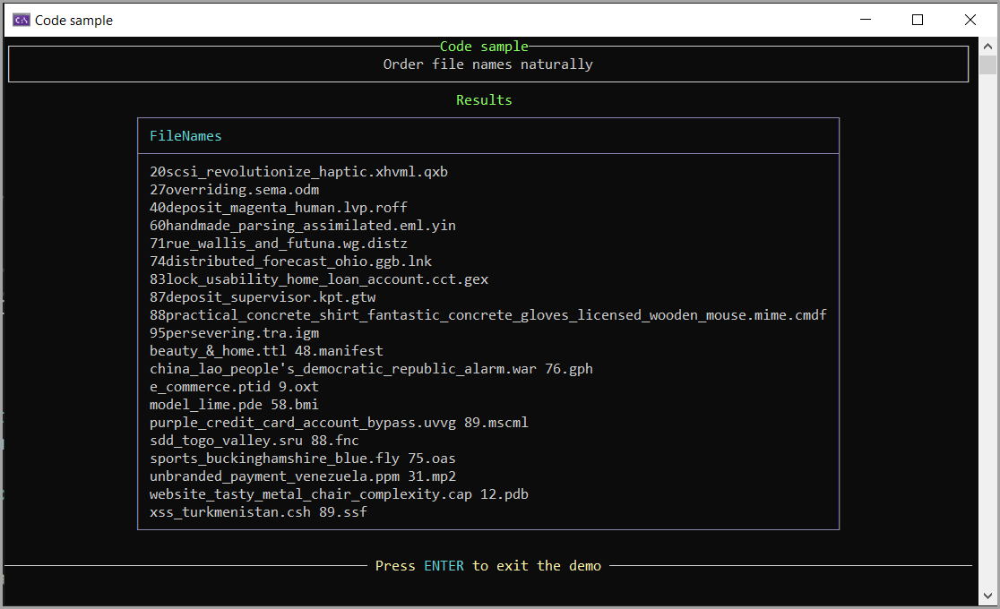

# About

Code sample to provide a language extension to sort file names as in Windows Explorer.

## Requies

- Microsoft Visual Studio 2022 17.18.0 or higher
- Bogus NuGet package
- GenericMathLibrary for IsEven extension
