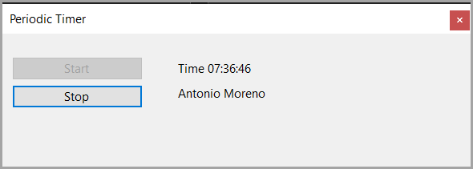

An example for [PeriodicTimer](https://learn.microsoft.com/en-us/dotnet/api/system.threading.periodictimer?view=net-8.0) which gets a random contact record every quarter minute using [Dapper](https://github.com/DapperLib/Dapper) to read from NorthWind2024 [SQLite](https://www.sqlite.org/) database.

Any errors are sent to a log file using [SeriLog](https://serilog.net/) along with displaying the error to Visual Studio output window when executed from debugging via <kbd>F5</kbd>

