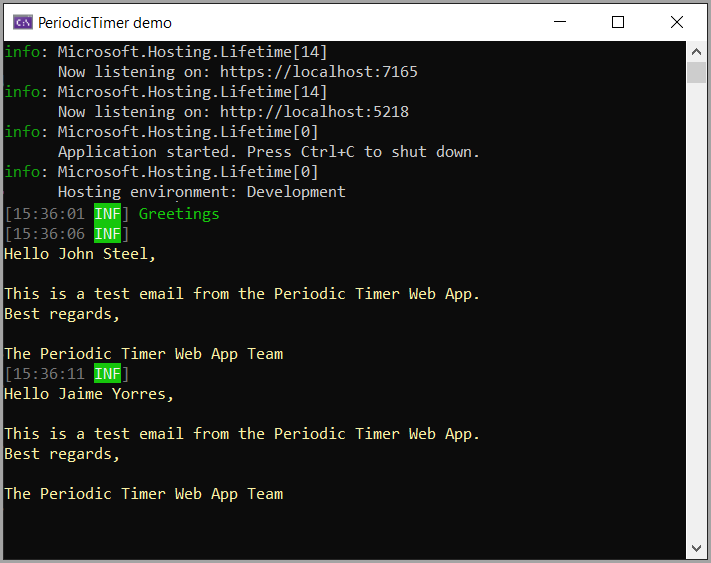

# About

An example for [PeriodicTimer](https://learn.microsoft.com/en-us/dotnet/api/system.threading.periodictimer?view=net-8.0) which gets a random contact record every quarter minute using [Dapper](https://github.com/DapperLib/Dapper) to read from NorthWind2024 SQL-Server database.

Output goes to the terminal window. Here we are outputting random contact email messages.

