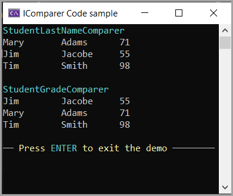

# About

Demonstrates

- Creating Comparer using [IComparer](https://learn.microsoft.com/en-us/dotnet/api/system.collections.icomparer?view=net-8.0)&lt;T> using a model that we want to sort on LastName and/or Grade.
- Primary constructors




## Model

Uses primary constructor. The override ToString is for demonstration only to write out data in a foreach statement.

```csharp
public class Student(string firstName, string lastName, double grade)
{
    public string FirstName { get; set; } = firstName;
    public string LastName { get; set; } = lastName;
    public double Grade { get; set; } = grade;
    
    public override string ToString() 
        => $"{FirstName, -10} {LastName, -10} {Grade}";
}
```

## Comparers

Both sort assending

```csharp
public class StudentGradeComparer : IComparer<Student>
{
    public int Compare(Student? x, Student? y)
    {
        if (x.Grade > y.Grade)
        {
            return 1;
        }
        else if (x.Grade < y.Grade)
        {
            return -1;
        }
        else
        {
            return 0;
        }
    }
}

public class StudentLastNameComparer : IComparer<Student>
{
    public int Compare(Student? x, Student? y)
        => string.Compare(x.LastName, y.LastName, StringComparison.OrdinalIgnoreCase);
}
```
