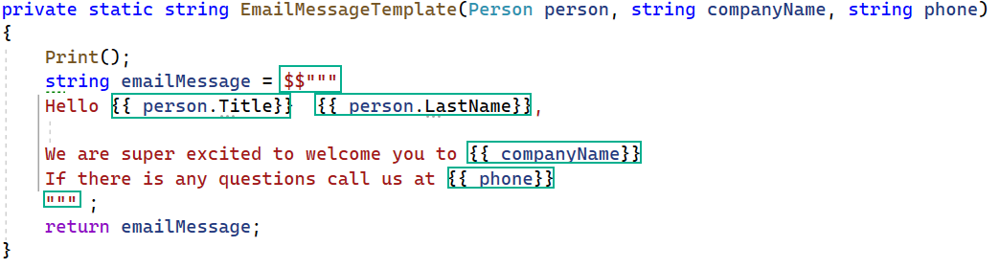

# Raw string literals

Raw string literals to make you more productive and improve readability by avoiding escaping content inside strings.

Raw string literals start and end with at least three double quotes ("""..."""). Within these double quotes, single " are considered content and included in the string. Any number of double quotes less than the number that opened the raw string literal are treated as content. 

Raw string literals also have new behavior around automatically determining indentation of the content based on leading whitespace.

Most of the code samples circulating the web are a) Microsoft b) those who copied Microsoft. With that I wanted to have some examples I think make sense and are easy to follow which is what this project is above. Take time to study the code rather than simple copy and paste.

# Documentation

See Microsoft [docs](https://devblogs.microsoft.com/dotnet/csharp-11-preview-updates/) and the following [page](https://learn.microsoft.com/en-us/dotnet/csharp/whats-new/csharp-11#raw-string-literals).