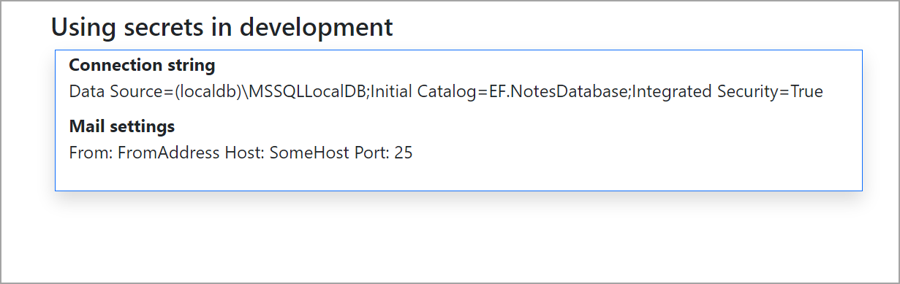

# ASP.NET Core/Razor pages Secret Manager

Learn how to store sensitive data during development of an application where the code will be stored in source control such as a GitHub repository so that your sensitive data is not exposed to those who should not have access to this data.

## Are secrets secure?

No, secrets are stored as plain text.

## Sharing with team members

About the only choice is [Azure Key Vault](https://azure.microsoft.com/en-gb/products/key-vault/).


## What happens if I get a new computer

- Right click on the project in solution explorer.
- Select Manage User Secrets
- Once the file opens, right click and select open containing folder.
- In Windows Explorer, go up two levels, copy the folder to a removable drive and paste into the new computer

Or as indicated below, simply copy a json file which was used to initially create the secrets and run on the new computer.

## Sharing secrets with your team


## From Microsoft

The Secret Manager tool stores sensitive data during the development of an ASP.NET Core project. In this context, a piece of sensitive data is an app secret. App secrets are stored in a separate location from the project tree. The app secrets are associated with a specific project or shared across several projects. The app secrets aren't checked into source control.

> **Warning**
> The Secret Manager tool doesn't encrypt the stored secrets and shouldn't be treated as a trusted store. It's for development purposes only. The keys and values are stored in a JSON configuration file in the user profile directory.

## What do I get here that I can't get from Microsoft?

How to properly setup secrets in a file located outside of the Visual Studio solution folder structure.

## Steps to working with secrets

1. Create a new Razor Pages or ASP.NET Core project.
1. Open a terminal window at the root of the project.
1. Run `dotnet user-secrets init` which places an entry into the project file.

```xml
<PropertyGroup>
   <TargetFramework>net7.0</TargetFramework>
   <UserSecretsId>1fe850fa-6fb3-4320-8003-b70d16d1a649</UserSecretsId>
</PropertyGroup>
```

4.  From here, decide what you want to store as secrets. For this article we want to store a database connection string and settings to send email messages.


The **appsettings.json**

```json
{  
  "ConnectionStrings": {
    "DefaultConnection": "Enter anything here"
  },
  "MailSettings": {
    "FromAddress": "",
    "Host": "",
    "Port": 0,
    "TimeOut": 0,
    "PickupFolder": ""
  }
}
```

5. Create a class to read MailSettings from appsettings.json

```csharp
public class MailSettings
{
    public string FromAddress { get; set; }
    public string Host { get; set; }
    public int Port { get; set; }
    public int TimeOut { get; set; }
    public string PickupFolder { get; set; } = "MailDrop";
}
```

For the connection string we do not need a class.

**Storing data for the secrets manager**

Create a folder named DotnetSecrets off the root of C to store a json file outside of the Visual Studio solution. Keeping this simple, lets call it secrets.json and add the following.

```json
{
  "ConnectionStrings:DefaultConnection": "Data Source=(localdb)\\MSSQLLocalDB;Initial Catalog=EF.NotesDatabase;Integrated Security=True",
  "MailSettings": {
    "FromAddress": "FromAddress",
    "Host": "SomeHost",
    "Port": 25,
    "TimeOut": 3000,
    "PickupFolder": "MailDrop"
  }
}
```

To add the settings above, in a terminal window execute the following.

```
type C:\DotnetSecrets\secrets.json | dotnet user-secrets set --project "C:\VS2022\LanguageFeatures\SecretManager1\SecretManager1.csproj"
```

> **Note**
> Alter the path and project name for --project above for when doing this for your project.

**Validation**

Right click on your project, select Manage user secrets which opens secrets.json for this project and will appear as follows.


```json
{
  "ConnectionStrings:DefaultConnection": "Data Source=(localdb)\\MSSQLLocalDB;Initial Catalog=EF.NotesDatabase;Integrated Security=True",
  "MailSettings:FromAddress": "FromAddress",
  "MailSettings:Host": "SomeHost",
  "MailSettings:Port": "25",
  "MailSettings:TimeOut": "3000",
  "MailSettings:PickupFolder": "MailDrop"
}
```

Or from the terminal at the project root 


```
dotnet user-secrets list
```

In this case we get

```
MailSettings:TimeOut = 3000
MailSettings:Port = 25
MailSettings:PickupFolder = MailDrop
MailSettings:Host = SomeHost
MailSettings:FromAddress = FromAddress
ConnectionStrings:DefaultConnection = Data Source=(localdb)\MSSQLLocalDB;Initial Catalog=EF.NotesDatabase;Integrated Security=True
```


**Reading settings into your page**

- Setup a string property for ConnectionString
- Setup MailSettings using the class MailSettings above and is located under the Models folder.
- Add a private field IConfiguration for dependency injection in the contructor of the page.
- Assign the property _configuration in the page contructor.

```csharp
public class IndexModel : PageModel
{
    [BindProperty]
    public string ConnectionString { get; set; }
    private IConfiguration _configuration;
    [BindProperty]
    public MailSettings MailSettings { get; set; }
    public IndexModel(IConfiguration configuration)
    {
        _configuration = configuration;
    }

    public void OnGet()
    {
        ConnectionString = _configuration["ConnectionStrings:DefaultConnection"]!;
        MailSettings = _configuration.GetSection("MailSettings").Get<MailSettings>()!;
    }
}
```

- For OnGet read back the settings.

To validate setting have been properly read set a breakpoint on the closing bracket of OnGet, run the project and inspect the properties.

Also, in the sample project.

```html
<div class="container">
    <h1 class="fs-4 mt-2">Using secrets in development</h1>
    
    <div class="row shadow mt-2 border border-primary ms-1">
        <dl>
            <dt>Connection string</dt>
            <dd>@Model.ConnectionString</dd>

            <dt>Mail settings</dt>
            <dd>@Model.MailSettings</dd>
        </dl> 
    </div>
</div>
```




## Set multiple secrets 

Above provided how to setup multiple secrets but wanted to note that in the [documentation](https://learn.microsoft.com/en-us/aspnet/core/security/app-secrets?view=aspnetcore-7.0&tabs=windows#set-multiple-secrets) the following is shown.

```
type .\input.json | dotnet user-secrets set
```

If you do this the input.json file would be in the project folder and circuments using secrets. Always store secrets files outside of the solution folder.


## Resources

- [Safe storage of app secrets in development in ASP.NET Core](https://learn.microsoft.com/en-us/aspnet/core/security/app-secrets?view=aspnetcore-7.0&tabs=windows)
- [Manage user secrets with Visual Studio](https://learn.microsoft.com/en-us/aspnet/core/security/app-secrets?view=aspnetcore-7.0&tabs=windows#manage-user-secrets-with-visual-studio)