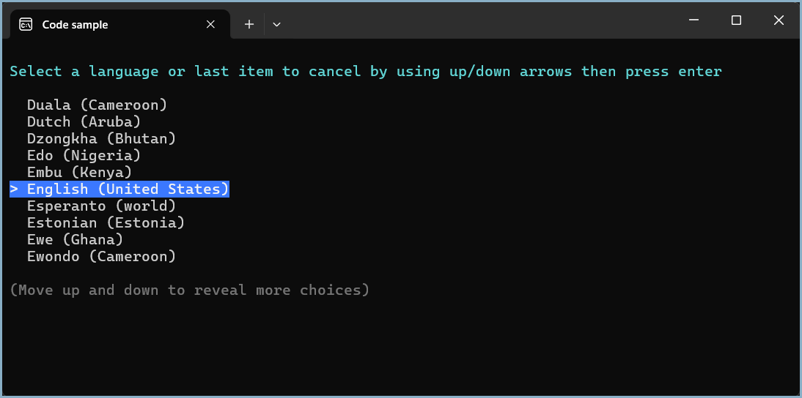

# About

This project provides an example for creating a menu system that can be used in either a conventional console project or a dotnet tool using [Spectre.Console NuGet package](https://www.nuget.org/packages/Spectre.Console/0.50.1-preview.0.5).

