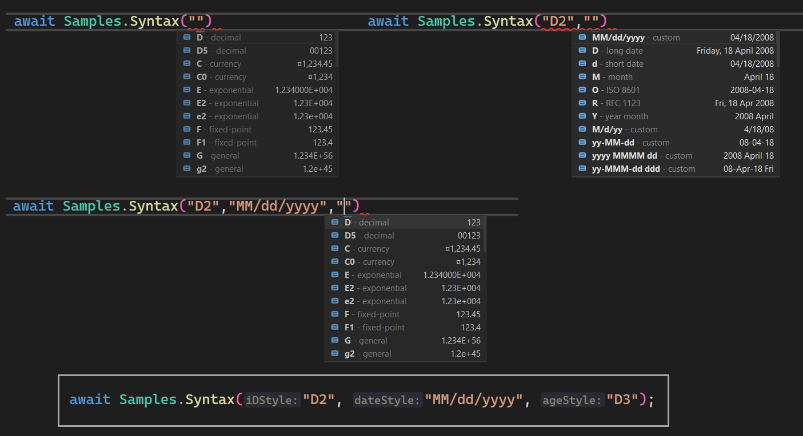

# About

Example for [StringSyntaxAttribute Class](https://learn.microsoft.com/he-il/dotnet/api/system.diagnostics.codeanalysis.stringsyntaxattribute?view=net-7.0).

- One sample using conventional formatting for two int, one DateOnly.
- One sample using StringSyntax formatting for two int, one DateOnly.
- One sample using a custom StringSyntax formatting for two int, one DateOnly from appsettings.json.

## Services

See the class `ApplicationConfiguration` which is responsible for reading the data connection string and custom values for the custom formatting.

## StringSyntax

