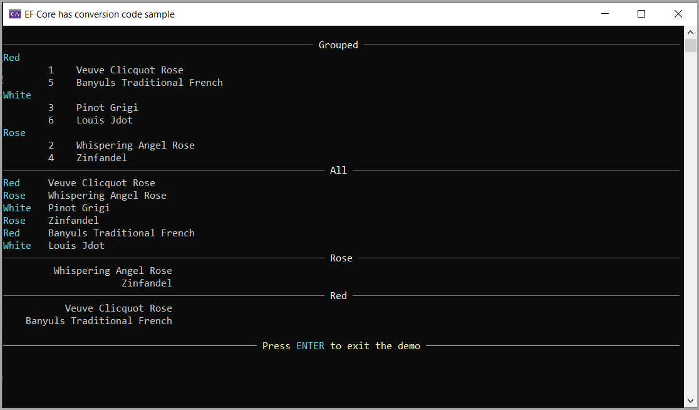
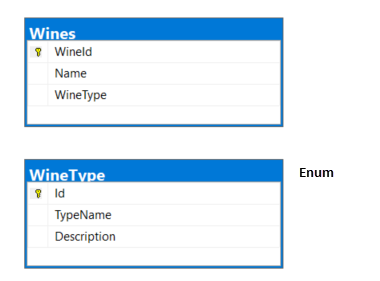

# About

A basic code sample on working with [enumerations](https://learn.microsoft.com/en-us/dotnet/csharp/language-reference/builtin-types/enum) as a model for EF Core. For the demonstration to be easy to run the first time executing the application a check is done to see if the database exists, if not, the database is created and tables are populated in the DbContext.



## Written 

With NET8, EF Core 8

# Tables



# Conversions

Using [HasConversion](https://learn.microsoft.com/en-us/ef/core/modeling/value-conversions?tabs=data-annotations#the-valueconverter-class) for [WineType](Models/WineType.cs) to map between enum member and int.


```csharp
protected override void OnModelCreating(ModelBuilder modelBuilder)
{
    modelBuilder
        .Entity<Wine>()
        .Property(e => e.WineType)
        .HasConversion<int>();
```

# Code

Example to filter on a specific wine type

```csharp
List<Wine> rose = context.Wines.Where(wine => wine.WineType == WineType.Rose).ToList();
```

Example to group by wine type using a class [WineGroupItem](Models/WineGroupItem.cs) to provide the ability to pass to a caller.
```csharp
List<WineGroupItem> allWinesGrouped = context.Wines
    .GroupBy( wine => wine.WineType)
    .Select(w => new WineGroupItem(w.Key, w.ToList()))
    .ToList();
```


# T4 Template

This is optional, the idea is if someone added, deletes or modifies data in the table WineTypes the enum is also updated. To take this a step farther [invoke text transformation in the build process](https://learn.microsoft.com/en-us/visualstudio/modeling/code-generation-in-a-build-process?view=vs-2022&tabs=csharp).

