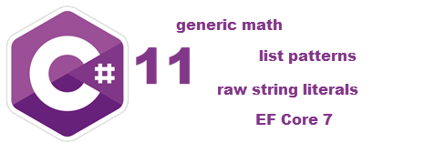

# New features C# 11 and EF Core 7, NET 8

This repository is dedicated to new features in C# 11 in .NET Core 7 along with several code samples for EF Core 7. There are many sites which offer code samples yet from what I’ve seen most are the same and don’t go very deep into the new features. Here you will find code samples that are ready to run and for the most part easy to understand.

There are many other features to explore, what is included here is a subset that are more important for the everyday developer.

In many cases a free NuGet package is used, [Spectre Console](https://spectreconsole.net/) which provides easy methods to colorize and create menu for console projects.

# Source code

All source code was created by Karen Payne except several of the EF Core 7 projects which is indicated in each of the projects, TableSplittingSample and  GetStartedWinForms (Karen made adjustments to these projects)

# Important

Since C# 11 came out a week before this post there may be things that didn't make it in to this release and many sites will indicate you need a preview version of C#, not true after the first week of November 2022.

**Do not** feel the need to use these new features just to use them, instead learn what can be done with these features and use them were the task at hand warrents their use.

# Required

Micosoft Visual Studio version 17.4 or higher

# See also

- Microsoft [What's new in C# 11](https://learn.microsoft.com/en-us/dotnet/csharp/whats-new/csharp-11)
- [Performance Improvements in .NET 7](https://devblogs.microsoft.com/dotnet/performance_improvements_in_net_7/)
- [C#'s Generic Math from F#](https://dev.to/entomy/cs-generic-math-from-f-31a7)

